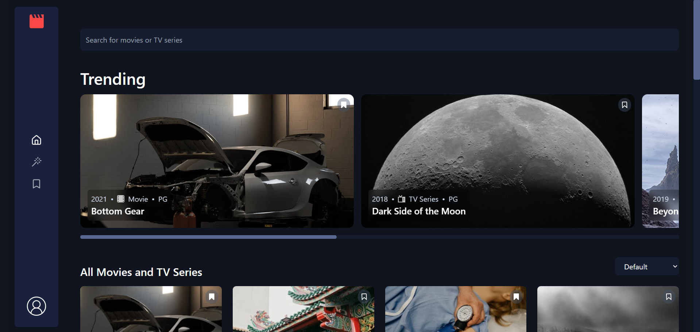
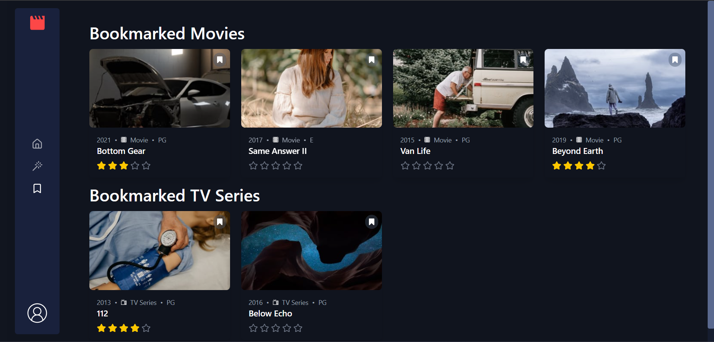

# 🎬 Movie Recommendation Web App

A personalized movie recommendation web application built using **React**, **Tailwind CSS**, and **Firebase**. Users can sign in via Google, rate movies on a 5-star scale, bookmark favorites, and receive tailored recommendations based on their preferences.

---

## 🚀 Features

- 🔐 **Google Sign-In** with Firebase Authentication
- 🎥 **Movie Catalog** loaded from JSON with responsive thumbnails
- ⭐ **5-Star Rating System** for each movie
- 🔖 **Bookmark Movies** for later viewing
- 🔄 **Randomized Movie Order** per user to ensure fair exposure
- 💾 **Persistent Storage** using Firestore and LocalStorage
- 🎨 **Modern UI** using Tailwind CSS and Lucide Icons

---

## 🧠 Technologies Used

### Frontend:
- React (Context API, Hooks)
- Tailwind CSS
- Lucide-react for icons

### Backend / Services:
- Firebase Authentication (Google Sign-In)
- Firebase Firestore for user-specific data
- LocalStorage for client-side persistence

---

## 📁 Project Structure

src/
│
├── components/
│ └── MovieCard.jsx # Displays each movie with rating & bookmark
│
├── Context/
│ └── BookmarkContext.jsx # Manages movie state globally
│
├── firebase/
│ └── firebase.js # Firebase config and initialization
│
├── data.json # Movie metadata (title, year, rating, etc.)
└── App.jsx # Main component with routing and layout

---

## 📸 Screenshots

| Home Page | Movie Card | Rating |
|----------|------------|--------|
|  |  |  |

---

## 🛠️ Installation

### Prerequisites:
- Node.js v14+
- Firebase project with Firestore and Authentication enabled

### Setup Instructions:

1. **Clone the repository**

git clone https://github.com/your-username/movie-recommender-app.git
cd movie-recommender-app

2. **Install dependencies**

npm install

3. **Firebase Setup**

Create a Firebase project.
Enable Google Sign-In in Authentication.
Create a Firestore Database.
Get your Firebase config and update firebase/firebase.js:

const firebaseConfig = {
  apiKey: "YOUR_API_KEY",
  authDomain: "YOUR_PROJECT_ID.firebaseapp.com",
  ...
};

3. **Run the development server**

npm run dev

##🔄 Future Improvements
- **Add real-time recommendations using Flask backend or ML model
- **Search and filter functionality by genre/year/trending
- **Admin dashboard to manage movie data
- **User analytics dashboard (watch history, rating behavior)

##✨ Credits
Created by Rishabh Singh
B.Tech CSE(ICB) @ D.J. Sanghvi College of Engineering