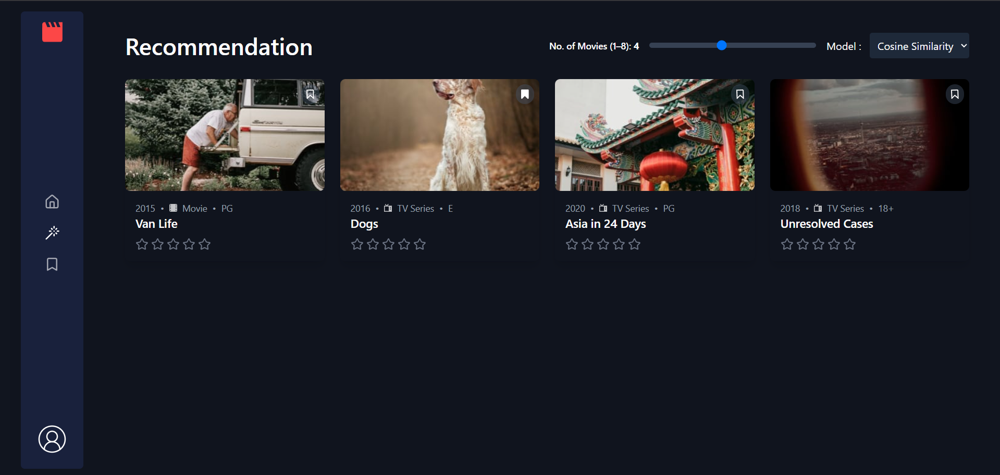

# 🎬 Movie Recommendation Web App

A personalized movie recommendation web application built using **React**, **Tailwind CSS**, **Flask**, and **Firebase**. Users can sign in via Google, rate movies on a 5-star scale, bookmark favorites, and receive tailored recommendations powered by a deployed Flask backend using multiple recommendation models.

---

## 🚀 Features

- 🔐 **Google Sign-In** with Firebase Authentication  
- 🎥 **Movie Catalog** loaded from JSON with responsive thumbnails  
- ⭐ **5-Star Rating System** for each movie  
- 🔖 **Bookmark Movies** for later viewing  
- 🔎 **Add movie search & filters** (genre/year)
- 🔄 **Randomized Movie Order** per user to ensure fair exposure  
- 🎯 **Personalized Recommendations** from Flask backend (SVD, KNN, fallback models)  
- 💾 **Persistent Storage** using Firestore and LocalStorage  
- 🔁 **Cold Start Handling** using popular/highest-rated fallback logic  
- 🔒 **Secure Firebase Key Handling** via base64-encoded env variable  
- 🌐 **Live Deployment** with Vercel (frontend) & Render (backend)  

---

## 🧠 Technologies Used

### Frontend:
- React (Context API, Hooks)
- Tailwind CSS
- Lucide-react for icons
- React Router DOM

### Backend:
- Flask (Python)
- Movie Recommendation Engine (SVD, KNN, Fallback models)
- Render Deployment

### Services:
- Firebase Authentication (Google Sign-In)
- Firebase Firestore for user-specific data
- LocalStorage for client-side sync

---

## 📁 Project Structure

```
src/
├── components/
│   ├── MovieCard.jsx          # Movie display with rating & bookmark
│   ├── TrendingCard.jsx       # Highlighted cards for trending movies
│   ├── Navbar.jsx             # Top bar with branding & auth
│   ├── SidebarIcon.jsx        # Sidebar nav for route switching
│   ├── ScrollToTop.jsx        # Scroll-to-top on route change
│   └── Login.jsx              # Google Sign-In handler
│
├── Pages/
│   ├── Layout.jsx             # Global wrapper with Navbar/Sidebar
│   ├── MainContent.jsx        # Movie list page
│   ├── Recommendation.jsx     # Fetched recommendation page (GET /recommendations)
│   ├── Bookmarked.jsx         # Bookmarked movies and shows
│   └── Nopage.jsx             # 404 route
│
├── Context/
│   ├── BookmarkContext.jsx    # Bookmark/rating state & syncing logic
│   └── AuthContext.jsx        # Auth state and Firestore syncing
│
├── firebase.js                # Firebase configuration
├── data.json                  # Static movie dataset (~29 movies)
└── App.jsx                    # Main routing logic
```

---

## 📸 Screenshots

| Home Page |
|-----------------------|
|  |

|Recommendation Page |
|----------------------|
|  |

|  Bookmarked |
|----------------------|
|   |


---

## 🛠️ Installation

### Prerequisites:
- Node.js v14+
- Firebase project with Firestore and Google Auth
- Python 3.8+ and Flask installed

---

### 🔧 Setup Instructions

1. **Clone the repository**

```bash
git clone https://github.com/Rishabh763/Movie-Recommendation-System.git
cd movie-recommender-app
```

2. **Frontend Setup**

```bash
npm install
```

Create a `.env` file and store your Firebase config safely:
```env
VITE_FIREBASE_API_KEY=your_key
VITE_FIREBASE_AUTH_DOMAIN=your_auth_domain
# etc...
```

Run the development server:

```bash
npm run dev
```

3. **Backend Setup (Flask)**

```bash
cd backend/
pip install -r requirements.txt
```

Create a `.env` file with:
```env
FIREBASE_KEY_B64=your_base64_encoded_service_account
```

Start the Flask server:
```bash
python app.py
```

---

## 🌍 Deployment

- **Frontend** hosted on [Vercel](https://vercel.com)  
- **Backend** deployed via [Render](https://render.com)  
- **Secure Firebase Key** is base64-encoded and added to Render environment

---

## 🔄 Future Improvements

- 📈 Show analytics dashboard (top-rated, trends)
- 🧪 Add unit tests and error boundaries
- 🎛️ Admin panel for adding new movies

---

## ✨ Credits

Created by **Rishabh Singh**  
B.Tech CSE(ICB) @ D.J. Sanghvi College of Engineering
